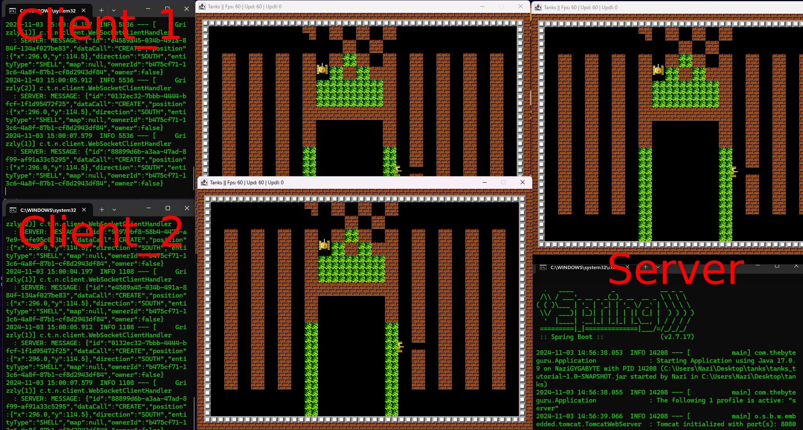

# Tanks
*Simple multiplayer (client-server) java 2D game, based on websockets.*

Thanks to original author:  
***TheByteGuru***
- [YouTube](https://www.youtube.com/@thebyteguru9928/featured)
- [GitHub](https://github.com/TheByteGuru)

## Prerequisites:
- Java (JDK 17 or 21)
- Maven

## How to Build:
```shell
mvn clean build
```

## How to Run:
Create 2 .bat files with these configurations:  
1. Server
```shell
color a
cls
java -jar tanks_tutorial-1.0-SNAPSHOT.jar %~dp0 --server.enabled=true --server.port=8080 --spring.profiles.active=server
pause
```

2. Client
```shell
color a
cls
java -jar tanks_tutorial-1.0-SNAPSHOT.jar %~dp0 --server.enabled=false --client.url=ws://localhost:8080 --server.port=9000 --spring.profiles.active=client --spring.main.web-application-type=none
pause
```

Put also 2 files to same directory
1. level_0.txt
2. texture_atlas.png

Now start Server.bat first, and then Client.bat  
You can also play over network, just change client configuration --client.url=ws://TARGET_IP:TARGET_PORT

## Controls:
**WASD** - movement   
**Z** - fire  
**Space** - respawn (works only if player is dead)

## Screenshot:

</a>